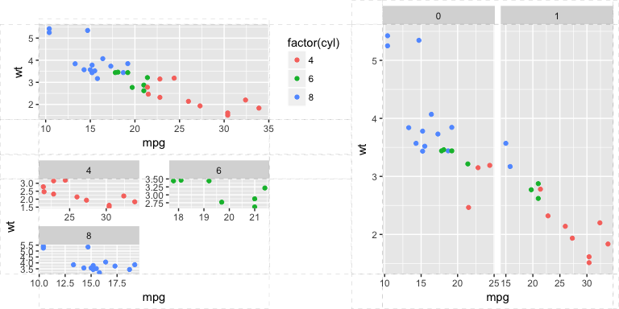
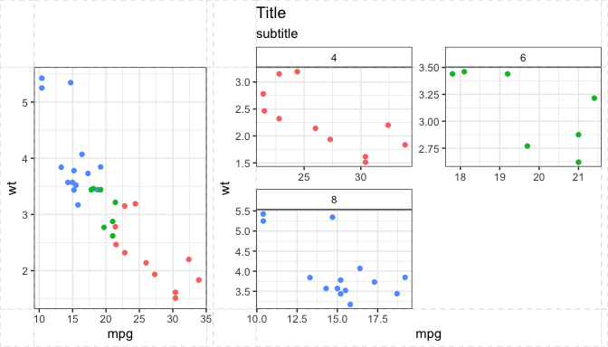

<!-- README.md is generated from README.Rmd. Please edit that file -->
egg package
===========

Misc. doomed tricks for ggplot2.

Exposing ggplot2 layouts
------------------------

``` r
p1 <- qplot(mpg, wt, data = mtcars, colour = cyl)
p2 <- qplot(mpg, data = mtcars) + ggtitle("title")
p3 <- qplot(mpg, data = mtcars, geom = "dotplot")
p4 <- p1 + facet_wrap( ~ carb, nrow = 1) + theme(legend.position = "none") +
  ggtitle("facetted plot")
pl <- lapply(list(p1, p2, p3, p4), expose_layout, FALSE, FALSE)
grid.arrange(
  grobs = pl,
  widths = c(1.2, 1, 1),
  layout_matrix = rbind(c(1, 2, 3),
                        c(4, 4, 4))
)
```


Setting panel size
------------------

``` r
p1 <- qplot(mpg, wt, data = mtcars, colour = cyl)
p2 <- p1 + facet_wrap( ~ carb, nrow = 1)
grid.arrange(grobs = lapply(
  list(p1, p2),
  set_panel_size,
  width = unit(2, "cm"),
  height = unit(1, "in")
))
```


Aligning complex ggplots
------------------------

``` r
p1 <- ggplot(mtcars, aes(mpg, wt, colour = factor(cyl))) +
  geom_point()

p2 <- ggplot(mtcars, aes(mpg, wt, colour = factor(cyl))) +
  geom_point() + facet_wrap(~ cyl, ncol = 2, scales = "free") +
  guides(colour = "none") +
  theme()

p3 <- ggplot(mtcars, aes(mpg, wt, colour = factor(cyl))) +
  geom_point() + facet_grid(. ~ am, scales = "free") + guides(colour="none")

g1 <- ggplotGrob(p1)

g2 <- ggplotGrob(p2)

g3 <- ggplotGrob(p3)

fg1 <- gtable_frame(g1, debug = TRUE)
fg2 <- gtable_frame(g2, debug = TRUE)
fg12 <- gtable_frame(gtable_rbind(fg1, fg2),
                     width = unit(2, "null"),
                     height = unit(1, "null"))
fg3 <-
  gtable_frame(
    g3,
    width = unit(2, "null"),
    height = unit(1, "null"),
    debug = TRUE
  )
grid.newpage()
combined <- gtable_cbind(fg12, fg3)
grid.draw(combined)
```



Arranging and aligning multiple plots
-------------------------------------

This is a convenience function based on the above, more useful than `grid.arrange` for the special case of ggplots as it aligns the plot panels,

``` r
p1 <- ggplot(mtcars, aes(mpg, wt, colour = factor(cyl))) +
  geom_point() +
  guides(colour = "none") +
  theme_bw() + theme(strip.background = element_blank())

p2 <- ggplot(mtcars, aes(mpg, wt, colour = factor(cyl))) +
  geom_point() + facet_wrap(~ cyl, ncol = 2, scales = "free") +
  guides(colour = "none") +
  labs(title = "Title", subtitle = "subtitle") +
  theme_bw() + theme(strip.background = element_rect(fill = "transparent"))

ggarrange(p1, p2, widths = 1:2)
```



Widths and heights should correspond to the layout.

``` r
p <- ggplot()
ggarrange(p, p, p, widths = c(3, 1), heights = c(5, 1))
```


Custom geom
-----------

The function `geom_custom` extends the ggplot2 function `annotation_custom` to cases where multiple grobs are to be placed, e.g. on different panels, or at different positions in a plot. This geom is a bit special in that it does not truly respect a *grammar of graphics* -- arbitrary grobs can be plotted, with no explicit mapping to variables. Its typical use would be to place illustrating images on a plot.

``` r
codes <- data.frame(country = c("nz","ar","fr","gb","es"))
codes$y <- runif(nrow(codes))
codes$url <- sapply(codes$country, sprintf, fmt="https://github.com/hjnilsson/country-flags/raw/master/png250px/%s.png")

gl <- Map(function(x, y) {
  destfile <- paste0(y, '.png')
  if(!file.exists(destfile))
    download.file(x, destfile = destfile)
  png::readPNG(destfile)
}, x = codes$url, y = codes$country)

codes$raster <- I(gl)

ggplot(codes, aes(x = country, y = y)) + 
  geom_point() +
  geom_custom(data = codes, aes(data=raster), 
              grob_fun = rasterGrob, 
              fun_params = list(height=unit(1,"cm")))
```


