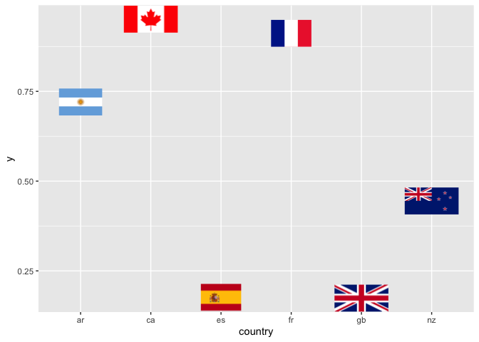

[](https://github.com/baptiste/egg/actions)

<!-- README.md is generated from README.Rmd. Please edit that file -->

# egg package

This document provides a brief overview of the main utiilty functions
included in the `egg` package.

## Exposing ggplot2 layouts

``` r
p1 <- qplot(mpg, wt, data = mtcars, colour = cyl)
p2 <- qplot(mpg, data = mtcars) + ggtitle("title")
p3 <- qplot(mpg, data = mtcars, geom = "dotplot")
p4 <- p1 + facet_wrap( ~ carb, nrow = 1) + theme(legend.position = "none") +
  ggtitle("facetted plot")
pl <- lapply(list(p1, p2, p3, p4), expose_layout, FALSE, FALSE)
grid.arrange(
  grobs = pl,
  widths = c(1.2, 1, 1),
  layout_matrix = rbind(c(1, 2, 3),
                        c(4, 4, 4))
)
```

<!-- -->

## Setting panel size

``` r
p1 <- qplot(mpg, wt, data = mtcars, colour = cyl)
p2 <- p1 + facet_wrap( ~ carb, nrow = 1)
grid.arrange(grobs = lapply(
  list(p1, p2),
  set_panel_size,
  width = unit(2, "cm"),
  height = unit(1, "in")
))
```

<!-- -->

## Aligning complex ggplots

This is a convenience function similar to `grid.arrange`, specialised
for ggplot2 objects, which attempts to align the plot panels,

``` r
p1 <- ggplot(mtcars, aes(mpg, wt, colour = factor(cyl))) +
  geom_point() +
  guides(colour = "none") +
  theme_bw() + theme(strip.background = element_blank())

p2 <- ggplot(mtcars, aes(mpg, wt, colour = factor(cyl))) +
  geom_point() + facet_wrap(~ cyl, ncol = 2, scales = "free") +
  guides(colour = "none") +
  labs(title = "Title", subtitle = "subtitle") +
  theme_bw() + theme(strip.background = element_rect(fill = "transparent"))

ggarrange(p1, p2, widths = 1:2, debug = TRUE)
```

<!-- -->

Widths and heights should correspond to the layout.

``` r
p <- ggplot()
ggarrange(p, p, p, widths = c(3, 1), heights = c(5, 1))
```

<!-- -->

For convenience, labels can be added to refer to the subfigures. All
parameters of `textGrob` can be used for the formatting of the labels,
including the positioning (`x`, `hjust`, etc.).

``` r
ggarrange(p1, p2, p3, ncol=2,
          labels = c("A", "b)", "iii."), 
          label.args = list(gp=gpar(font=4), 
                            x=unit(1,"line"), hjust=0))
```

<!-- -->

## Custom geom

The function `geom_custom` extends the ggplot2 function
`annotation_custom` to cases where multiple grobs are to be placed,
e.g. on different panels, or at different positions in a plot. This
geom is a bit special in that it does not truly respect a *grammar of
graphics* – arbitrary grobs can be plotted, with no explicit mapping to
variables. Its typical use would be to place annotations (images,
tables, …). The data used to create the annotation is passed as a
list-column.

``` r
codes <- data.frame(country = c("nz","ca","ar","fr","gb","es"))
codes$y <- runif(nrow(codes))

gl <- lapply(codes$country, 
                    function(.x) png::readPNG(system.file("flags", 
                                             paste0(.x,".png"),
                                             package="egg")))

codes$raster <- I(gl)


ggplot(codes, aes(x = country, y = y)) + 
  geom_point() +
  geom_custom(data = codes, aes(data=raster), 
              grob_fun = rasterGrob, 
              fun_params = list(height=unit(1,"cm")))
```

<!-- -->
